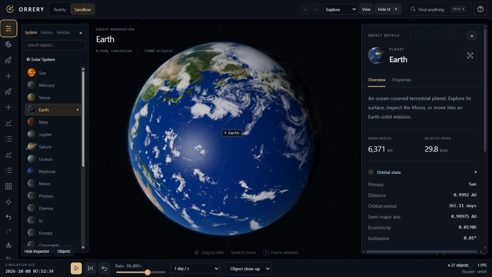

# Orrery



**Explore the Solar System and nearby stars. Build planetary systems. Plan missions.**


Orrery is a local-first 3D astronomy and orbital dynamics workspace: approximate solar-system ephemerides, an editable N-body sandbox, spacecraft analysis, and a configurable multistage rocket mission simulator. The original Phase 1 SI state, worker ownership protocol, revision gating, and conservation baselines remain in place.

The simulation fills the window. A compact object navigator, collapsible tool panels, selectable workspace layouts, and keyboard navigation surround it. Press **H** to hide or restore the interface. The [camera and exploration guide](docs/camera-navigation.md) documents the rebuilt navigation system; the [flight guide](docs/exploration-upgrade.md) covers missions. Planet maps are bundled locally; the application does not load fonts or textures from third-party servers at runtime.

## Run on Windows

Requires Node.js 20.19+ (tested with 22.14) and Python 3.11+ (tested with 3.13).

```powershell
npm.cmd ci
python -m venv .venv
.\.venv\Scripts\python.exe -m pip install -r backend/requirements.txt
```

Start the API in one terminal:

```powershell
.\.venv\Scripts\python.exe -m uvicorn backend.main:app --host 127.0.0.1 --port 8000
```

Start the frontend in another:

```powershell
npm.cmd run dev
```

Open http://127.0.0.1:5173. Vite proxies /api to port 8000. The backend is optional for local physics, editing, presets, IndexedDB autosave, and JSON export; it is required for Horizons and shared scenarios.

## Scientific workbench

The tool rail groups features under **Explore, Simulate, Missions, Analyze and Lab**. Ctrl+K discovers advanced workspaces. The lazy-loaded scientific workbench provides the Earth–Mars reference mission, measured certification/debrief, replay, bounded sensitivity runs, departure/arrival Lambert grids, reference-frame/time readouts, numerical comparisons and stress tests. Reports contain actual integrated results. The [scientific guide](docs/scientific-missions.md) documents controls and fidelity limits.

## Workspace

- **Reality** initializes at the current UTC date. Planets use JPL Table 1 with century rates. Major moons use documented circular mean-orbit approximations with illustrative phases.
- **Sandbox** snapshots the current position AND velocity and evolves gravitational dynamics. Body edits are applied at the next worker revision.
- **Inspector** edits mass, radius, density, state vectors, bound orbital elements, spin, appearance, trails, constraints, collision overrides, and metadata. Per-field units and global preferences preserve SI internally.
- **Create objects** place/throw objects in the ecliptic plane, spawn extreme objects, and brush rings, streams, fields or clouds. Inspector actions include circularize, duplicate, moon, binary companion, fragment, mass/radius scaling, velocity operations, barycenter centering, and parameterized supernova.
- **What-If laboratory** preserves the original scenario while an editable branch evolves. Compare matched-epoch cloned simulations, schedule future changes, save child scenarios, preview bounded random experiments and export measured reports. See the [What-If guide](docs/what-if.md) and [motion architecture](docs/motion.md).
- **Prediction** integrates a cloned state in a separate worker. Duration, resolution and mass preview are configurable. Dashed paths include planned burns. The displayed horizon is the horizon actually computed within the budget.
- **Scenario library** includes 37 built-in examples, searchable categories/tags, saved/recent local snapshots, shared-ID loading, import/export, and backend sharing.
- **Simulation settings** select integrator, solver, adaptive controls, collisions, GR approximation, units, visual quality, accessibility, cameras and capture.
- **Events** combines collision/tidal/mission events with conservation diagnostics.

## Universe exploration and scientific discovery

**Universe** adds a non-simulating nearby-star catalog, exoplanet systems, schematic Milky Way/Local Group maps and scale navigation. Selection and camera focus remain separate. Entering catalog navigation preserves and pauses the live simulation; returning restores it.

- **Catalog data:** 3,934 nearby HYG stars and 19 NASA composite exoplanets in five systems; missing measurements remain Unknown, estimated/minimum masses retain provenance. See [data attribution and licensing](docs/astronomy-data.md).
- **System Builder:** primary configuration, real orbital-element placement, Hill-spaced generation, binary/triple experiments, moons, belts and comets.
- **Formation laboratory:** bounded gravitating planetesimals, massless dust, actual collision accretion and disk metrics; explicitly educational, without gas dynamics or migration.
- **Interstellar missions:** static-endpoint relativistic cruise and proper-acceleration profiles, Earth/proper time, kinetic-energy lower bounds and communication timelines. Technology labels do not certify requested capabilities; speeds at or above c are rejected.
- **Observation / Time Machine:** physical angular diameter and phase, local sky, telescope, source-labelled date initialization and bounded worker Event Finder.
- **Mission Analyst / Sensors / Challenges:** deterministic explanations, actual-state orbital criteria, optical inset, geometric reference stars/proximity, optional schematic magnetic/radiation/cutaway layers.
- **Favorites and sessions:** object/system/scenario/mission/view favorites, navigation history and validated exploration JSON snapshots with recorded epoch.

The [Universe Explorer guide](docs/universe-explorer.md) documents controls, coordinate transforms, scientific scope, limits and an acceptance checklist. Catalog visualizations and educational graphics never silently become gravity sources. The original worker, camera, What-If, vehicle and sharing contracts remain in place.

## Rocket View and mission control

Use **Mission planner → Add launch vehicle at departure** to keep the entire solar system running around the launch, or load **Launch vehicle** from Scenarios for an isolated Earth test. Choose **Ignition / launch** to release the rotating-Earth pad constraint and start the engine. The worker integrates gravity, changing mass, pressure-dependent engine performance, layered-atmosphere drag, feedback guidance, stage separation, insertion, and payload deployment.

Throttle, target altitude, manual pitch/heading/roll, Isp, thrust, stage masses, drag area and coefficient are editable. Guidance and auto-staging are independently switchable. The default launch is covered by an automated end-to-end test that reaches a bound orbit before fuel exhaustion.

Telemetry shows MET, phase, position, velocity, acceleration, vertical/horizontal speed, thrust, fuel, stage, orientation, dynamic pressure, and orbital elements. Charts contain actual recorded worker samples. Export CSV, JSON, or a Markdown mission report. The model is a point-mass demonstrator, not a flight-certified 6-DOF simulator.

## Satellite View

Load LEO, MEO, GEO, polar, Sun-synchronous-like, elliptical, highly elliptical, or the 24-satellite constellation. Satellite View adds altitude, latitude/longitude, inertial and ground-relative speeds, power, payload, orbital parameters, ground tracks, stations and communication links.

Communication status includes range, geometric line of sight, propagation delay and an explicitly approximate free-space loss estimate. Power responds to finite-disc sunlight, penumbra and umbra; eclipse transitions enter the event log. Earth-fixed longitudes use an explicitly illustrative J2000 Greenwich origin. The SSO-like preset sets inclination only: J2 nodal precession is not modeled.

Maneuver planning supports prograde, retrograde, radial, normal and arbitrary inertial-vector burns. Burns execute at their scheduled epoch and appear in prediction/event logs. They are ideal impulses. Rocket burns can debit active-stage propellant using the rocket equation; insufficient fuel rejects the burn atomically. Non-rocket burns remain ideal commanded impulses. These planned burns do not model finite engine duration.

## Transfers and exploration

The planner computes zero-revolution Lambert transfers against a moving, osculating destination and shows circular Hohmann launch-window estimates. Planet departures report heliocentric transfer estimates; parked vehicles use a hyperbolic ejection calculation and reject paths crossing the departure surface. Explicit cruise demonstrations skip launch/escape. All resulting vehicles propagate under the existing N-body solver.

SOI entry/exit updates analysis frames and logs events without teleporting or switching off other gravity sources. Navball directions, staged delta-v, fuel flow, target range, apsis events and circularization burns are available in Flight operations. Moon/Mars examples add thrust-driven descent guidance and bounded touchdown checks. **Lab → Reference mission** now runs a reproducible Earth launch through fuel-aware Mars capture and two verification orbits. The [scientific mission guide](docs/scientific-missions.md) explains the measured criteria, deterministic replay and approximation boundaries. Lambert estimates alone still do not guarantee an encounter.

God Mode, the collision laboratory, live measurement tool, influence guides, minimap and optional tracking inset work in the same scene. The solar preset includes eight planets and 18 major moons; moon phases and mean circular paths are approximate unless Horizons replaces them.

## Physics choices

Velocity Verlet remains the default. RK4 and embedded Dormand-Prince 5(4) are available. Adaptive acceleration caps use eta × min sqrt(softening/|a|). DP separately accepts/rejects trial steps using position/velocity absolute tolerances and a relative tolerance.

Gravity is always direct between massive sources. Direct or Barnes-Hut evaluation is selectable for non-sourcing test particles. Auto selects the tree above 500 total bodies; theta defaults to 0.5.

Collision modes are disabled, merge, restitution bounce, and impact-energy fragmentation. Resolved fragments retain mass and center-of-mass momentum. Fluid Roche disruption is optional. Event energy/angular-momentum jumps adjust diagnostic baselines instead of being reported as numerical drift.

The optional dominant-primary 1PN correction reproduces Mercury's weak-field perihelion advance in the test suite. It is not a full relativistic N-body or geodesic solver. Black holes use Newtonian attraction, Schwarzschild capture, tidal fragmentation, and procedural accretion/lensing visuals. Wormholes are explicitly experimental transport rules with orientation transforms and cooldown.

## Horizons

Open **Horizons**, choose an epoch and optionally add Pluto, Ceres, Voyager 1/2 or JWST.

- Initialization fetches heliocentric J2000-ecliptic SI vectors and switches to locally propagated Sandbox state.
- One-day playback fetches 33 vectors per target and interpolates with cubic Hermite position/velocity interpolation.
- Loading is atomic across requested bodies. Failed or unsupported upstream targets leave the current state intact.
- Coverage endpoints clamp playback. There is no silent extrapolation.
- Availability and accuracy depend on NASA's target coverage and interpolation spacing. Local propagation is not presented as continuing JPL ephemerides.

## Rendering and performance

Camera-relative positions are formed in Float64 before Three.js receives local coordinates. System, planetary, Earth-orbit, local-vehicle and true-radius views use different display units. **Scientific** preserves physical distances and radii; **Visibility** enlarges bodies; **Educational** compresses system distances logarithmically; **Custom** exposes separate multipliers. Display transforms never change SI physics.

Bundled CC BY 4.0 planet maps, day/night shading, clouds, atmospheric rims, solar emission, rings and procedural custom materials improve surface readability. A deterministic generated star distribution supplies background depth; it is not an astrometric star catalog.

Particles/fragments use one instanced mesh; background stars use one point draw. Low/Medium/High/Ultra/Auto quality adjusts pixel ratio and bloom; low quality bounds trails and sphere detail. FPS, frame interval, physics batch time, worker throughput, counts, draw calls and trail points are exposed. An optional WebGPU compute path advances non-sourcing tracers with Float32 Verlet while massive sources remain Float64 CPU. Unsupported configurations and device failures fall back to CPU. See [GPU measurements and precision limits](docs/gpu-compute.md).

Motion interpolates completed worker publications for rendering only; telemetry and editing stay authoritative. Vehicle attitudes use quaternion interpolation, physical stages remain independent bodies, and progressive trail histories use capped circular buffers. Pause settles on the completed worker boundary; it does not roll back a batch already in flight.

Limits: **20,000 bodies**, **512 massive sources**, **64 fragments per event**, **200 retained events**, **2,400 telemetry samples**, **32 MiB scenario payloads**. Experiment comparison is limited to 1,000 bodies per branch, 32 paths and a 12-second worker budget; longer horizons may return partial results. Sandbox epochs support 1800–2999 while approximate Reality retains 1800–2050 coverage. Dense source systems, many close encounters, portal rendering, prediction and recording reduce throughput. The clock slows to actual integrated time when the worker's 12 ms / 512-substep budget is reached. No unconditional 60 FPS claim is made.

## Cameras and capture

Use **System views** for the angled Solar System overview, top/side views or Inner Planets. Framing includes visible orbit ellipses and accounts for open panels only when explicitly requested; selecting objects or opening panels does not reposition the camera.

The rebuilt camera has one owner and explicit Free, Orbit, Follow, Chase, Target Lock, Cinematic, Surface, Rocket and Satellite modes. Free uses camera-local WASDQE and yaw/pitch mouse-look; selection cannot refocus it. Manual input cancels automated focus. OrbitControls acts only on a proxy in Orbit/Follow. Adaptive/logarithmic speed, Ctrl precision, Shift boost, optional pointer lock, separate damping, reference frames, collision protection, camera history, SI bookmarks and presets are available in Camera navigation. Surface and telescope views use actual radii. Cinematic keyframes interpolate over eight seconds per segment.

PNG captures the viewport. WebM records the viewport at selectable output height and requested frame rate when MediaRecorder supports it. Browser encoding may drop frames. UI compositing, audio capture, GPU timestamp timing, and full GR ray tracing are unavailable and are not represented by fake controls.

## Controls and accessibility

Drag/touch to orbit; wheel/pinch to zoom; middle-drag/two fingers to pan. Click to select; double-click or F to focus. Single-click selection stays independent of the camera. In Free, drag looks around and wheel changes speed (Alt + wheel dollies). The System / Moons / Vehicles filters help navigate related objects. Use Overview for live measurements and Properties for editing.

| Key | Action |
| --- | --- |
| Space | Play / pause |
| H | Hide / restore all interface |
| F | Focus local view |
| Shift F | Follow selected body |
| G | Open God Mode |
| . | Step simulation |
| R | Reverse time direction |
| Ctrl-drag / Shift-drag body | Move / add velocity in Sandbox |
| Ctrl/Cmd K | Command palette |
| Ctrl/Cmd Z | Undo |
| Ctrl/Cmd Shift Z | Redo |
| W A S D, Q E | Free camera movement |
| Shift / Ctrl | Temporary boost / precision |
| C | Optional pointer lock |
| Alt Left / Right | Camera navigation history |
| F3 / F4 | Performance / camera debug HUD |
| Escape | Close dialog / cancel placement |
| ? | Help |

The palette accepts actions and “jump to YYYY-MM-DD”. Dialogs trap focus and restore it. Inputs are labeled; warnings include text. Reduced motion, high contrast, and text scaling are supported. Small screens use a horizontal toolbar and scrollable bottom sheet. The six-step onboarding tour is dismissible.

## Observation, encounters and replay

Observation and planet comparison report live geometry and physical properties. Toggle terminators, idealized restricted-three-body Lagrange markers and Hill spheres. Encounter operations previews velocity matching, bounded approach/hold assistance, escape and capture burns. Local maneuver components resolve in the current orbital basis at execution; orbit-line placement sets an osculating burn epoch. Closest approach is measured over actually integrated segments, including partial-horizon warnings.

Mission replay records complete physical snapshots with fuel, stages and events. Playback is read-only and scrubs only captured states; Return to Live restores the saved live state. Limits are 240 snapshots, 32 MiB and 1,000 bodies. See [replay schema](docs/replay-schema.md). Date bookmarks reinitialize Reality and do not invent historical Sandbox states.

## Persistence and security

IndexedDB autosaves every five seconds and retains explicit saved/recent scenarios. Version 1 files migrate to version 2. Exports include bodies, settings, views/cameras, missions, vehicle configurations, burns, stations, bounded telemetry/events, and sampled trail history. Negative zero is normalized at the JSON boundary. Experiment branches add optional parent metadata and up to 256 scheduled changes. While What-If is active, root autosave preserves the original scenario and a separate key autosaves the experiment session, including the original pause state. Saved sessions are validated before recovery; corrupt records leave the live scenario intact.

Shared scenarios use unguessable read IDs and separate edit-key capabilities. The URL permits reading; updating, deleting, metadata editing and camera writes require X-Edit-Key. No user authentication is introduced. The in-memory rate limiter is suitable for one API process; deploy an edge/shared limiter before scaling to multiple processes.

## Production deployment

```powershell
npm.cmd run build
npm.cmd run preview
```

Serve dist/ with SPA fallback (including /s/*), proxy /api to FastAPI, and use HTTPS. Serve local assets with compatible same-origin resource policies. Add:

```text
Cross-Origin-Opener-Policy: same-origin
Cross-Origin-Embedder-Policy: require-corp
```

These headers and a secure context enable SharedArrayBuffer. The transferable ArrayBuffer fallback remains operational without them; append ?fallback to exercise it explicitly. The worker retains exactly-one-RPC ownership and stale-revision rejection in either transport. Worker load/decode failures and stalled RPCs end the session with a visible error; editing a parameter or returning to Reality retries with a fresh worker. Prediction workers support cancellation and a timeout.

Configure ORRERY_DB for the SQLite path and ORRERY_ORIGINS for comma-separated allowed origins. Keep SQLite and edit keys out of public static directories. API OpenAPI docs are at /docs.

## Verification

```powershell
npm.cmd test -- --reporter=verbose --silent=false
.\.venv\Scripts\python.exe -m pytest backend/tests -q
npm.cmd run build
```

Extended checks: `npm.cmd run test:reference` (launch, Mars capture and deterministic replay), `npm.cmd run benchmark` (CPU stress cases), and `node scripts/verify-horizons.mjs` (network-dependent multi-epoch ephemeris comparison).

See [VERIFICATION.md](VERIFICATION.md) for measured outcomes and the manual checklist, and the [bug-review report](docs/bug-review.md) for the latest fixes and regression coverage. The [upgrade prompt extension](docs/what-if-upgrade-prompt.md) retains the What-If/motion requirements separately from the implementation and verification claims.

Detailed references: [camera navigation](docs/camera-navigation.md), [replay](docs/replay-schema.md), [physics](docs/physics.md), [architecture](docs/architecture.md), [rendering](docs/rendering.md), [missions](docs/missions.md), [API](docs/api.md), [scenario schema](docs/scenario-schema.md).

Texture authorship and license: [Solar System Scope / INOVE](https://www.solarsystemscope.com/textures/), [CC BY 4.0](https://creativecommons.org/licenses/by/4.0/), [local attribution](public/textures/ATTRIBUTION.md). The maps are static artwork based on scientific imagery, with adjusted colors and some reconstructed regions.

## Development status

Orrery is an actively developed simulation workspace, not a flight-certified or fully relativistic simulator. Automated physics checks do not establish visual quality or certify the complete original roadmap. See VERIFICATION.md for tested behavior and unresolved limits. GitHub Actions runs frontend tests/build and backend tests on pushes and pull requests.
